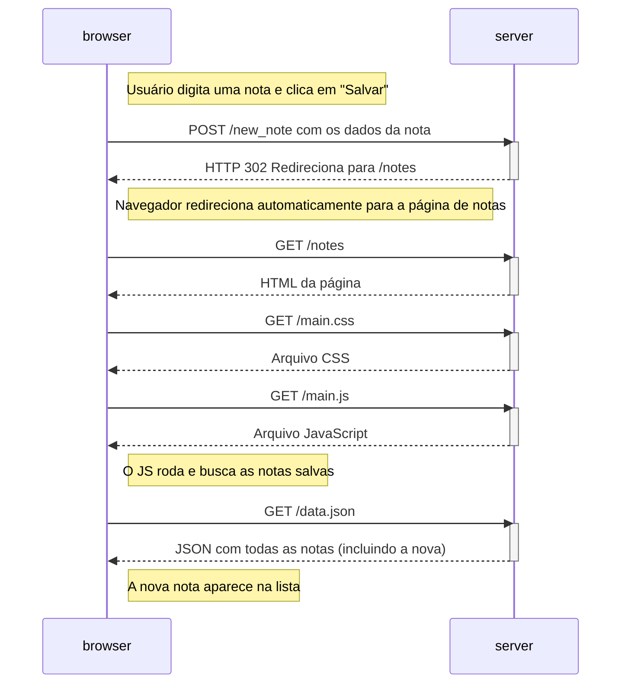

```mermaid
sequenceDiagram
   participant browser
    participant server

    Note right of browser: Usuário digita uma nota e clica em "Salvar"

    browser->>server: POST /new_note com os dados da nota
    activate server
    server-->>browser: HTTP 302 Redireciona para /notes
    deactivate server

    Note right of browser: Navegador redireciona automaticamente para a página de notas

    browser->>server: GET /notes
    activate server
    server-->>browser: HTML da página
    deactivate server

    browser->>server: GET /main.css
    activate server
    server-->>browser: Arquivo CSS
    deactivate server

    browser->>server: GET /main.js
    activate server
    server-->>browser: Arquivo JavaScript
    deactivate server

    Note right of browser: O JS roda e busca as notas salvas

    browser->>server: GET /data.json
    activate server
    server-->>browser: JSON com todas as notas (incluindo a nova)
    deactivate server

    Note right of browser: A nova nota aparece na lista
```