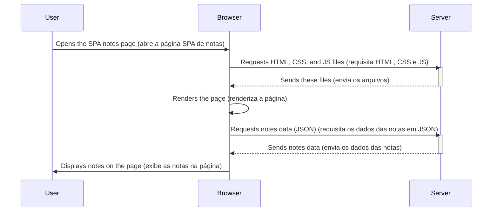

```mermaid
    sequenceDiagram
        participant User
        participant Browser
        participant Server

        User->>Browser: Opens the SPA notes page (abre a página SPA de notas)
        Browser->>Server: Requests HTML, CSS, and JS files (requisita HTML, CSS e JS)
        activate Server
        Server-->>Browser: Sends these files (envia os arquivos)
        deactivate Server

        Browser->>Browser: Renders the page (renderiza a página)
        Browser->>Server: Requests notes data (JSON) (requisita os dados das notas em JSON)
        activate Server
        Server-->>Browser: Sends notes data (envia os dados das notas)
        deactivate Server

        Browser->>User: Displays notes on the page (exibe as notas na página)


```