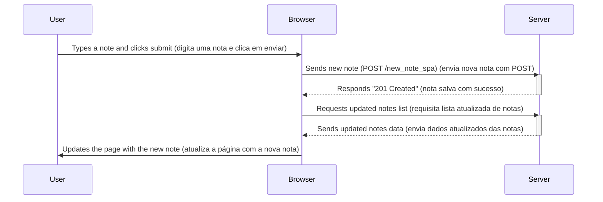

```mermaid
    sequenceDiagram
        participant User
        participant Browser
        participant Server

        User->>Browser: Types a note and clicks submit (digita uma nota e clica em enviar)
        Browser->>Server: Sends new note (POST /new_note_spa) (envia nova nota com POST)
        activate Server
        Server-->>Browser: Responds "201 Created" (nota salva com sucesso)
        deactivate Server

        Browser->>Server: Requests updated notes list (requisita lista atualizada de notas)
        activate Server
        Server-->>Browser: Sends updated notes data (envia dados atualizados das notas)
        deactivate Server

        Browser->>User: Updates the page with the new note (atualiza a página com a nova nota)
```